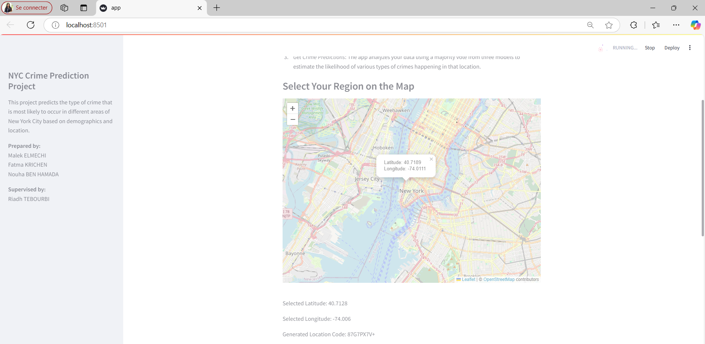
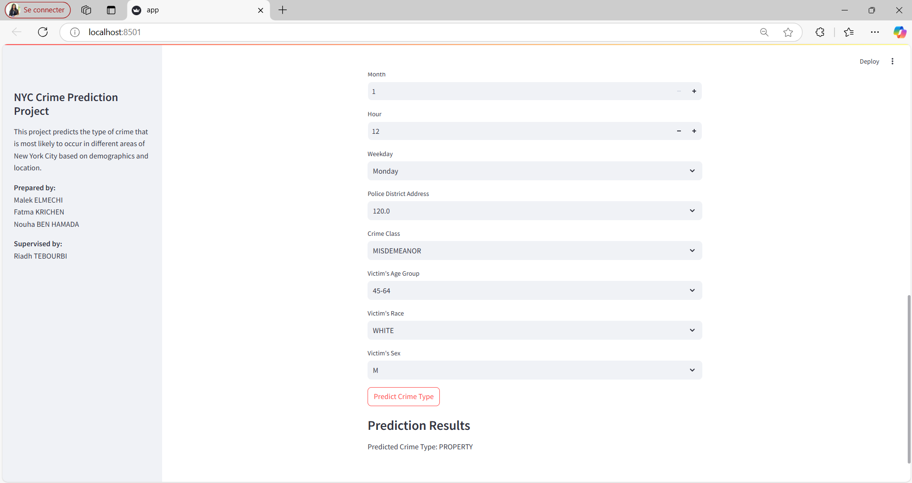

# NYC_Crime_Prediction

## Authors
- Nouha BEN HAMADA 
- Malek ELMECHI 
- Fatma KRICHEN

 ## Supervised by:
 Mr. Riadh TEBOURBI  
                
## AIM 2024/2025

## Abstract
This project explores the application of advanced data analysis techniques to predict crime types in New York City. By leveraging multimodal data sources, including historical crime records, socioeconomic data and environmental factors, we developed a predictive model that classifies crimes into four categories: Property, Personal, Sexual and Drugs/Alcohol.

The main goal is to assist law enforcement and policymakers in better understanding crime dynamics and devising targeted intervention strategies.

## Project Contents
1. **Introduction**: Overview of the challenges and objectives in urban crime prediction.
2. **Data Collection and Preparation**:
   - **Sources**: Public data from NYC Open Data.
   - **Data Cleaning**: Handling missing values and outliers.
   - **Exploration**: Analysis of key variables, such as demographics, temporal trends, and geographic hotspots.
3. **Modeling Techniques**:
   - **Models Used**: XGBoost, LightGBM, CatBoost and Neural Networks.
   - **Feature Engineering**: Creation of temporal, spatial and categorical features.
4. **Results**:
   - Comparison of model performance using accuracy, precision, recall, F1-score and AUC-ROC.

5. **Streamlit Interface**:
   - The project includes an interactive web application built using **Streamlit**:
     - Interactive map for selecting locations in New York City.
     - Main area for exploring crime predictions based on user inputs such as age, gender, location and time of day.
     - Prediction of crime type.

     

  
  
6. **Scientific Contribution**:
   - The findings of this project were consolidated and presented in a scientific paper titled **"NYC Crime Prediction"**.
   - The paper highlights the methodology, results and implications of the study.
     You can view the paper [here](./paper.pdf).
   - It serves as a comprehensive resource for academics, law enforcement and urban policy planners interested in crime prediction and urban safety strategies.

